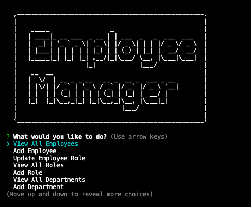

# Employee-Tracker

## Description

This application is a command-line CMS that lets companies manage their employee database. It was built using Node.js, Inquirer, and MqSQL.

## Table of Contents

- [Installation](#installation)
- [Usage](#usage)

## Installation

The user should clone the repository from GitHub and download Node.

## Usage

Use inquirer from your command line to manage your employee database.
View walk through video here - [Screencastify](https://drive.google.com/file/d/12ZjEOwQfc8VBqmTKb3rxJLoXKb-aj3BP/view?usp=sharing) 

